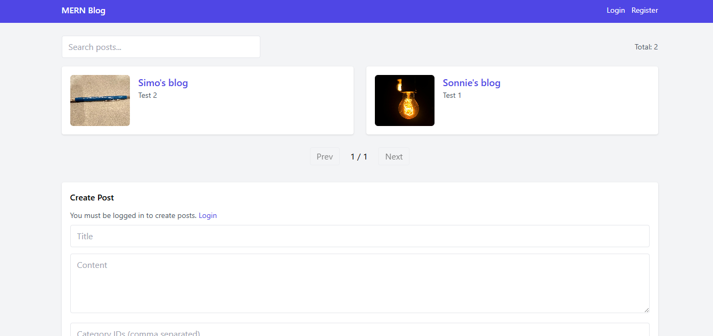
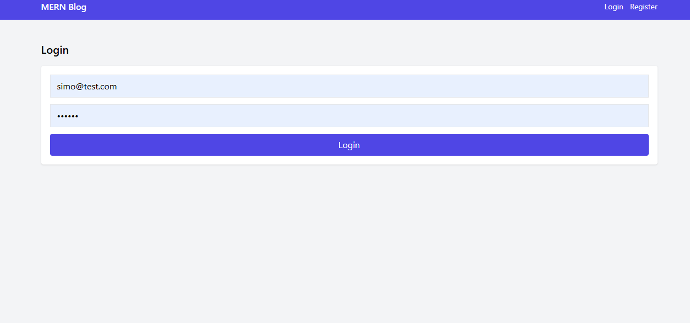
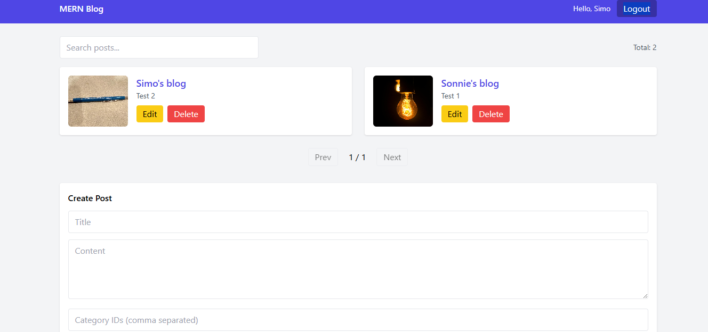

# MERN Blog — Single Page CRUD

A simple MERN (MongoDB, Express, React, Node.js) blog application with:

- JWT authentication
- CRUD operations for posts
- Image uploads with Multer
- Categories and comments
- Tailwind CSS styled UI
- Pagination
- React Router navigation

---

## Features

- User registration and login (JWT)
- Create, read, update, delete posts
- Upload featured images
- Add and view comments
- Pagination for posts
- Responsive design with Tailwind CSS

---

## Setup Instructions

### 1. Clone the repository

```bash
git clone https://github.com/PLP-MERN-Stack-Development/mern-stack-integration-Sim047.git
cd mern-stack-integration-Sim047
````

### 2. Backend Setup

```bash
cd server
npm install
```

Create a `.env` file:

```env
MONGO_URI=your_mongodb_atlas_connection_string
JWT_SECRET=your_jwt_secret
UPLOAD_DIR=./uploads
PORT=5000
```

Start the server:

```bash
npm run dev
```

Server runs at: `http://localhost:5000`

### 3. Frontend Setup

```bash
cd client
npm install
npm run dev
```

App runs at: `http://localhost:5173`

---

## Screenshots


 




---

## API Endpoints

* `POST /api/auth/register` — Register user
* `POST /api/auth/login` — Login user
* `GET /api/posts` — List posts
* `GET /api/posts/:id` — Get single post
* `POST /api/posts` — Create post
* `PUT /api/posts/:id` — Update post
* `DELETE /api/posts/:id` — Delete post
* `POST /api/posts/:id/comments` — Add comment

---

## Technologies

* Frontend: React, React Router, Tailwind CSS, Axios
* Backend: Node.js, Express, MongoDB, Mongoose, JWT, Multer

---

## Notes

* Logged-in users can create, edit, and delete posts.
* All users can view posts and comments.
* Images are served from `/uploads`.

```
